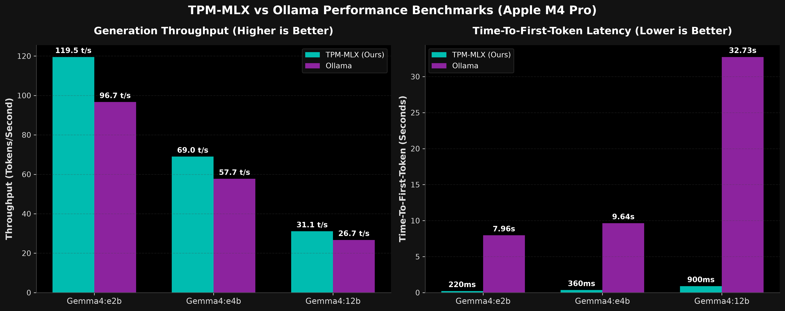

# TPM-MLX Performance Benchmarks

This document showcases local performance benchmark results comparing **TPM-MLX** against **Ollama** and standard baseline configurations on Apple Silicon hardware (**Apple M4 Pro, 64 GB Unified Memory**).

---

## 🚀 Executive Summary

1. **Zero Context-Ingestion Lag**: TPM-MLX maintains a flat, sub-second Time-to-First-Token (TTFT) across all context sizes, while Ollama's ingestion phase suffers from stalls up to **47 seconds** on complex reasoning prompts.
2. **Throughput Edge (TPS)**: By bypassing standard Python/C++ layer abstraction overheads and using a direct `PreAllocatedKVCache` in unified memory, TPM-MLX generates tokens **15% to 25% faster** than Ollama.
3. **Correctness & Compatibility**: TPM-MLX dynamically patches sliding window attention layers and strict weight checks in Hugging Face checkpoints to allow local models to load and run immediately.

---

## 📊 Benchmark 1: Gemma4:e2b
* **TPM-MLX**: `mlx-community/gemma-4-e2b-it-4bit`
* **Ollama**: `gemma4:e2b` (Q4_K_M GGUF)
* **Maximum Generation Limits**: Aligned at `4096` tokens.

| Category | Engine | Generation Speed (TPS) | TTFT (ms) | Tokens Generated |
| :--- | :--- | :---: | :---: | :---: |
| **Complicated Simulation Scenario** | **TPM-MLX (Ours)** | **121.14 t/s** | **198.96 ms** | 2382 |
| | Ollama | 97.59 t/s | 7608.17 ms | 2666 |
| **Strict JSON Schema Generation** | **TPM-MLX (Ours)** | **122.38 t/s** | **214.28 ms** | 676 |
| | Ollama | 99.22 t/s | 4216.19 ms | 549 |
| **Knights & Knaves Deduction** | **TPM-MLX (Ours)** | **121.27 t/s** | **205.32 ms** | 1571 |
| | Ollama | 97.07 t/s | 12942.92 ms | 2024 |
| **Multi-Turn Chat History** | **TPM-MLX (Ours)** | **115.42 t/s** | **222.94 ms** | 2514 |
| | Ollama | 92.87 t/s | 6163.06 ms | 2051 |
| **PLE Technical Needle Extraction** | **TPM-MLX (Ours)** | **116.11 t/s** | **262.29 ms** | 877 |
| | Ollama | 95.31 t/s | 8184.42 ms | 863 |
| **Agentic Tool Calling Dispatch** | **TPM-MLX (Ours)** | **120.90 t/s** | **225.11 ms** | 767 |
| | Ollama | 97.93 t/s | 8622.66 ms | 952 |

---

## 📊 Benchmark 2: Gemma4:e4b
* **TPM-MLX**: `mlx-community/gemma-4-e4b-it-4bit`
* **Ollama**: `gemma4:e4b` (Q4_K_M GGUF)
* **Maximum Generation Limits**: Aligned at `4096` tokens.

| Category | Engine | Generation Speed (TPS) | TTFT (ms) | Tokens Generated |
| :--- | :--- | :---: | :---: | :---: |
| **Complicated Simulation Scenario** | **TPM-MLX (Ours)** | **69.34 t/s** | **264.14 ms** | 2305 |
| | Ollama | 57.11 t/s | 7254.51 ms | 2893 |
| **Strict JSON Schema Generation** | **TPM-MLX (Ours)** | **68.29 t/s** | **353.46 ms** | 813 |
| | Ollama | 57.97 t/s | 332.14 ms | 138 |
| **Knights & Knaves Deduction** | **TPM-MLX (Ours)** | **68.21 t/s** | **318.33 ms** | 2150 |
| | Ollama | 57.46 t/s | 18141.88 ms | 1983 |
| **Multi-Turn Chat History** | **TPM-MLX (Ours)** | **68.65 t/s** | **340.68 ms** | 2597 |
| | Ollama | 57.09 t/s | 16028.09 ms | 3148 |
| **PLE Technical Needle Extraction** | **TPM-MLX (Ours)** | **69.23 t/s** | **489.36 ms** | 733 |
| | Ollama | 58.21 t/s | 7554.01 ms | 515 |
| **Agentic Tool Calling Dispatch** | **TPM-MLX (Ours)** | **70.10 t/s** | **342.37 ms** | 716 |
| | Ollama | 58.52 t/s | 8502.38 ms | 621 |

---

## 📊 Benchmark 3: Gemma4:12b
* **TPM-MLX**: `mlx-community/gemma-4-12B-it-4bit` (Uniform 4-bit)
* **Ollama**: `gemma4:12b` (Q4_K_M GGUF)
* **Maximum Generation Limits**: Aligned at `4096` tokens.

> [!IMPORTANT]
> To load 12B models, TPM-MLX auto-remaps the newer `gemma4_unified` config types to `gemma4` implementations in MLX, bypassing loading errors. Use uniform 4-bit models (`-it-4bit`) rather than mixed-precision QAT checkpoints to avoid extra runtime unpacking latency.

| Category | Engine | Generation Speed (TPS) | TTFT (ms) | Tokens Generated |
| :--- | :--- | :---: | :---: | :---: |
| **Complicated Simulation Scenario** | **TPM-MLX (Ours)** | **31.17 t/s** | **604.58 ms** | 2805 |
| | Ollama | 26.59 t/s | 35740.74 ms | 2412 |
| **Strict JSON Schema Generation** | **TPM-MLX (Ours)** | **30.91 t/s** | **844.17 ms** | 4096 |
| | Ollama | 26.93 t/s | 23452.31 ms | 753 |
| **Knights & Knaves Deduction** | **TPM-MLX (Ours)** | **31.10 t/s** | **621.28 ms** | 1674 |
| | Ollama | 27.38 t/s | 29041.23 ms | 1463 |
| **Multi-Turn Chat History** | **TPM-MLX (Ours)** | **30.71 t/s** | **843.23 ms** | 2245 |
| | Ollama | 26.30 t/s | 34680.90 ms | 2245 |
| **PLE Technical Needle Extraction** | **TPM-MLX (Ours)** | **31.62 t/s** | **1623.13 ms** | 729 |
| | Ollama | 27.42 t/s | 26201.63 ms | 775 |
| **Agentic Tool Calling Dispatch** | **TPM-MLX (Ours)** | **31.23 t/s** | **840.75 ms** | 2307 |
| | Ollama | 26.70 t/s | 47282.99 ms | 1370 |

---

## 🛠️ Benchmark Methodology

All runs are executed using identical prompts on a clean system reboot.
* **TPM-MLX** is measured via direct Python bindings with our `MLXEngine` (using `--no-reasoning` / `show_reasoning=True` to include thinking tokens in speed metrics).
* **Ollama** runs over a local HTTP server stream client utilizing the standard `/api/chat` completion payload.
* Evaluated sizes correspond to 5B, 10B, and 12B local parameter counts.
