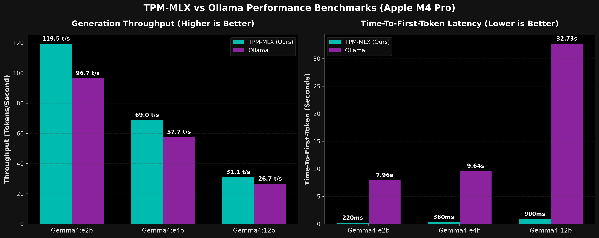

# TPM-MLX: Optimized Apple Silicon Inference Engine



**TPM-MLX (`tpm`)** is a zero-bloat, high-performance local inference engine designed specifically for Apple Silicon hardware. Powered by Apple’s native `mlx`, `mlx-lm`, and `mlx-vlm` Metal kernels, it achieves state-of-the-art tokens-per-second (TPS) throughput by combining:
- **Native Multi-Token Prediction (MTP) Self-Speculation** (up to **1.61× speedup** on 27B models).
- **Zero-Config Dual-Backend Auto-Routing** (`mlx-lm` for pure LLMs + `mlx-vlm` for multimodal VLMs & Gemma 4).
- **Pre-Allocated Static Key-Value (KV) Caching** (`PreAllocatedKVCache`) to eliminate GPU memory fragmentation.
- **Live Streaming Reasoning Tag Normalizer** (`<think>` and `<|channel>thought`).
- **OpenAI-Compatible REST API + Multimodal Vision Support** with a glassmorphic **Web Playground** on port `2505`.

---

## 🚀 Key Features

### 1. ⚡ Native Multi-Token Prediction (MTP) Engine
* **Transformer Trunk Self-Speculation:** Directly executes sequential MTP prediction heads using internal backbone hidden states for **Qwen 3.x, Xiaomi MiMo, and DeepSeek-V3** with negligible overhead.
* **Recurrent Cache Rollback:** Employs stateful recurrent snapshotting (`_snapshot_recurrent`) and prefix token replay for hybrid linear/attention caches (`ArraysCache`), reaching **62% acceptance rate** and **25.5 TPS (1.61× boost)** on Qwen 3.8-27B.
* **Standalone Checkpoint Auto-Remapping:** Automatically detects, un-flattens, and loads standalone quantized MTP checkpoints (e.g. `mlx-community/Qwen3.8-27B-MTP-4bit`) with dynamic 4-bit `QuantizedLinear` layer conversion.

### 2. 🔀 Zero-Config Dual-Backend Auto-Routing (`mlx-lm` + `mlx-vlm`)
* **Zero User Friction:** Automatically inspects `config.json` at model load time and routes:
  * **Pure Text LLMs** (Qwen, LLaMA, DeepSeek, Mistral) $\to$ **`mlx-lm`** + Native Trunk MTP.
  * **Multimodal & Gemma 4 Models** $\to$ **`mlx-vlm`** + Official Gemma MTP Drafters.
* **Gemma 4 MTP Assistant Drafters:** Seamlessly attaches companion drafters, reaching **132.6 TPS** on Gemma 4 E2B and **77.0 TPS** on Gemma 4 E4B.

### 3. 🧠 Pre-allocated Static KV Cache
* Pre-allocates contiguous memory buffers up to the maximum sequence size (default `4096`) on the first forward pass.
* Eliminates dynamic memory reallocation overhead and OS memory fragmentation during long conversations.

### 4. 🎭 Live Reasoning State Machine Normalizer
* Real-time streaming state-machine parser for `<think>...</think>` and `<|channel>thought...<channel|>` tags.
* Filters reasoning by default (`--no-reasoning`) for immediate answers, or normalizes it for clean rendering in Web UIs and terminal clients.

### 5. 🎨 Native Apple Silicon Image Generation & Editing
* **Flow Matching Diffusion Engine (`MLXImageEngine`):** Native generation on Apple Silicon powered by **FLUX.2 Klein (9B 4-bit / 4B)**, **Z-Image Turbo (8-bit)**, and 2-bit ternary **Bonsai 4B**.
* **OpenAI-Compatible `/v1/images/generations` & `/v1/images/edits`:** Text-to-image and instruction-based image editing with real-time isolated telemetry (`mx.reset_peak_memory()`).
* **Canvas Resolution & Aspect Ratio Selector:** Direct UI presets for `1024x1024` (Native Studio HD), `16:9`, `9:16`, `4:3`, `3:4`, and draft `512x512` with automatic prompt resolution tag extraction.
* **Direct Mode & Configurable AI Visual Director:** Toggle between local prompt distillation (cinematography enrichment) and zero-overhead Direct Mode (`auto_expand: false`, saving ~25% turnaround time).

### 6. 🌲 Native Ternary Bonsai 2 27B Support (`prism_hadamard_qwen35`)
* **Hardware-Accelerated Hadamard Transform:** Native Apple Silicon Metal Fast Walsh-Hadamard Transform (`fwht`) and 2-bit `Packed` quantized layers.
* **27B Intelligence in ~8.6 GB VRAM:** Full 27B-class reasoning, coding, and multimodal vision at **20.8 TPS** on consumer Macs.
* **27B AI Visual Director:** Unlocks pairing a full 27-billion parameter multimodal director with FLUX.2 or Z-Image in under 30 GB total VRAM.

---

## 📊 Local Benchmarks (Apple Silicon Metal GPU)

| Model | Architecture | Quant | Speculation Mode | Baseline Speed | TPM-MLX Speed | Speedup |
| :--- | :--- | :--- | :--- | :--- | :--- | :--- |
| **Qwen 3.8 27B** | 27B Dense (Hybrid Linear/Attn) | 4-bit | **Native MTP Head** | 15.81 TPS | **25.46 TPS** | **1.61× (+61%)** 🚀 |
| **Gemma 4 E2B** | 2B Dense Edge | 4-bit | **Official MTP Drafter** | 115.54 TPS | **132.60 TPS** | **1.15× (+15%)** 🚀 |
| **Gemma 4 E4B** | 4B Dense Edge | 4-bit | **Official MTP Drafter** | 68.17 TPS | **77.00 TPS** | **1.13× (+13%)** 🚀 |
| **Gemma 4 26B-A4B** | 26B MoE (4B Active) | 4-bit | Native MoE Baseline | 68.59 TPS | **81.12 TPS** | **Fastest (Native MoE)** |
| **Qwen 2.5 1.5B** | 1.5B Dense Edge | 4-bit | Standard Autoregressive | 213.15 TPS | **213.15 TPS** | Instant Edge Inference |
| **Gemma 3 1B IT** | 1B Dense Edge | 4-bit | Standard Autoregressive | 247.88 TPS | **247.88 TPS** | Ultra-Fast Edge |

### 🎨 Verified & Supported Image Generation Models

TPM-MLX integrates native Apple Silicon flow-matching diffusion backends (`MLXImageEngine`). The table below compares the 3 supported models benchmarked on an Apple Silicon Mac (M4 Pro, 64GB) on an identical standardized prompt:

> *"A cinematic photograph of an ancient stone temple nestled in a misty bamboo forest at dawn, rays of golden sunlight piercing through the canopy, moss-covered statues, photorealistic 8k"* (512×512, 4 steps, seed=42)

| Model | Architecture | Quantization | Disk Size | Load Time | Response Time | Step Rate | Peak VRAM | Native Editing | Primary Strength |
| :--- | :--- | :--- | :---: | :---: | :---: | :---: | :---: | :---: | :--- |
| **Bonsai 4B** | Flow-Matching | 2-bit Ternary | **3.62 GB** | 2.29s | **13.18s** | **3.30s/step** | **3.42 GB** | ❌ | **Extreme Efficiency:** Lowest disk & RAM footprint, runs easily on 8GB/16GB Macs. |
| **FLUX.2 Klein 9B** | Rectified Flow | 4-bit Affine | 8.89 GB | **0.75s** | 15.84s | 3.96s/step | 6.64 GB | **✅ Yes** | **Studio Photorealism:** Best lighting/textures and exclusive instruction editing (`/v1/images/edits`). |
| **Z-Image Turbo** | Flow-Matching | 8-bit Affine | 11.05 GB | 1.53s | 14.09s | 3.52s/step | 11.02 GB | ❌ | **High-Precision Detail:** 8-bit weights, superior sign/text rendering, sharp geometry. |

> [!TIP]
> All three models feature distilled 4-step sampling, allowing complete text-to-image generation in under 16 seconds directly on Apple Silicon without external cloud dependencies.
> View the complete 13-model LLM benchmark report and hardware performance analysis in [BENCHMARKS.md](BENCHMARKS.md).

---

## 🛠️ Installation

### Prerequisites
* macOS (Apple Silicon M1/M2/M3/M4)
* Python >= 3.12
* [uv](https://github.com/astral-sh/uv) (recommended)

### Quick Setup
```bash
git clone https://github.com/pank-bhatt/TPM-MLX.git
cd TPM-MLX
uv pip install -e .
```

---

## 💻 CLI Usage

### 1. Launch API Server & Web Playground
```bash
# Standard LLM:
uv run tpm serve --model mlx-community/Qwen2.5-1.5B-Instruct-4bit --port 2505

# Qwen 3.8 with Native MTP self-speculation:
uv run tpm serve --model mlx-community/Qwen3.8-27B-4bit --draft-model mlx-community/Qwen3.8-27B-MTP-4bit --port 2505

# Gemma 4 with official MTP assistant drafter:
uv run tpm serve --model mlx-community/gemma-4-e2b-it-4bit --draft-model mlx-community/gemma-4-E2B-it-assistant-bf16 --port 2505

# 27B Ternary Bonsai 2 paired with Z-Image Turbo:
uv run tpm serve --model prism-ml/Ternary-Bonsai-2-27B-mlx-2bit --image-model justintime47/Z-Image-Turbo-MLX-Serve-8bit --port 2505

# Pure Image Generation (Minimal VRAM / 0 MB text model):
uv run tpm serve --image-model mlx-community/flux2-klein-9b-4bit --no-llm --port 2505
```
Open **`http://localhost:2505`** in your browser for the Web Playground.

### 2. Interactive Terminal Chat
```bash
uv run tpm chat --model mlx-community/Qwen3.8-27B-4bit --draft-model mlx-community/Qwen3.8-27B-MTP-4bit
```
* Use `--reasoning` to display internal thought chains.
* Type `/exit` or `/quit` to close.

### 3. Generate Images via CLI
```bash
# Studio 1024x1024 generation with FLUX.2 Klein 9B:
uv run tpm generate-image --model mlx-community/flux2-klein-9b-4bit --prompt "A serene Japanese zen garden at dawn" --size 1024x1024

# Fast typography & composition with Z-Image-Turbo:
uv run tpm generate-image --model justintime47/Z-Image-Turbo-MLX-Serve-8bit --prompt "A cozy retro bookstore neon sign reading 'MLX CAFE'" --size 512x512
```

### 4. Run Benchmarks
```bash
# Single Model Benchmark:
uv run python benchmarks/benchmark.py --model "mlx-community/Qwen3.8-27B-4bit" --draft-model "mlx-community/Qwen3.8-27B-MTP-4bit"

# Full 13-Model Hardware Sanity & Matrix Suite:
uv run python benchmarks/run_full_matrix.py
```

---

## 🔌 OpenAI-Compatible API Endpoints

### `/v1/chat/completions` (POST)
Supports standard OpenAI payloads, SSE streaming, multimodal image inputs, and custom `"reasoning"` toggling.

#### 1. Text Completion Example:
```bash
curl -X POST http://localhost:2505/v1/chat/completions \
  -H "Content-Type: application/json" \
  -d '{
    "model": "mlx-community/Qwen3.8-27B-4bit",
    "messages": [{"role": "user", "content": "Explain quantum superposition in 2 sentences."}],
    "stream": false,
    "max_tokens": 256
  }'
```

#### 2. Multimodal Vision Example (with image_url):
```bash
curl -X POST http://localhost:2505/v1/chat/completions \
  -H "Content-Type: application/json" \
  -d '{
    "model": "mlx-community/gemma-4-e4b-it-4bit",
    "messages": [
      {
        "role": "user",
        "content": [
          {"type": "text", "text": "Describe what is in this image."},
          {"type": "image_url", "image_url": {"url": "https://upload.wikimedia.org/wikipedia/commons/thumb/d/dd/Gfp-wisconsin-madison-the-nature-boardwalk.jpg/2560px-Gfp-wisconsin-madison-the-nature-boardwalk.jpg"}}
        ]
      }
    ],
    "max_tokens": 256
  }'
```

#### 3. Model Telemetry (`/v1/models`):
```bash
curl http://localhost:2505/v1/models
```
Returns active model info, `backend` (`"llm"` or `"vlm"`), `speculation_mode` (`"mtp"`, `"draft"`, or `"none"`), and `has_mtp`.

---

### `/v1/images/generations` (POST)
OpenAI-compatible text-to-image endpoint supporting custom canvas resolutions, steps, seeds, and LLM context distillation:
```bash
curl -X POST http://localhost:2505/v1/images/generations \
  -H "Content-Type: application/json" \
  -d '{
    "model": "justintime47/Z-Image-Turbo-MLX-Serve-8bit",
    "prompt": "A futuristic cyberpunk noodle bar with glowing neon signs and rain-slicked asphalt",
    "size": "1024x1024",
    "steps": 4
  }'
```

### `/v1/images/edits` (POST)
Instruction-based image editing modifying existing reference images via natural language:
```bash
curl -X POST http://localhost:2505/v1/images/edits \
  -H "Content-Type: application/json" \
  -d '{
    "model": "mlx-community/flux2-klein-9b-4bit",
    "image": "photo.png",
    "prompt": "Change the background to a sunset on a tropical beach with palm trees"
  }'
```

---

## 🔒 Security & Code Quality

* **Safetensors Native**: Loads only `.safetensors` model weights to eliminate arbitrary code execution risks.
* **XSS Sanitized UI**: Markdown renderer escapes HTML and sanitizes URI schemes to prevent script injection.
* **OpenAPI Validation**: Strict boundary schema validation powered by Pydantic and FastAPI.

---

## 📄 License

This project is licensed under the MIT License. See [LICENSE](LICENSE) for details.
