# TPM-MLX Image Generation Benchmark Report

**Date:** 2026-09-29 22:37:19
**Platform:** Apple Silicon (64 GB Unified Memory, macOS)
**Common Prompt:** *"Generate a natural looking and photo-realistic image of a football player playing football in a field"*
**Fixed Seed:** `42` | **Flow Steps:** `4`

## Executive Summary & Comparison Table

| Model | Configuration | Resolution | Generation Time | Peak RAM / VRAM | Generated Output |
| :--- | :--- | :---: | :---: | :---: | :--- |
| **Bonsai 4B (2-bit Ternary)** | 🪄 With AI Director | `512x512` | **9.5s** | **8.57 GB** | [`bonsai_4b_2bit_with_director_512.png`](benchmark_images/bonsai_4b_2bit_with_director_512.png) |
| **Bonsai 4B (2-bit Ternary)** | 🪄 With AI Director | `1024x1024` | **30.73s** | **11.33 GB** | [`bonsai_4b_2bit_with_director_1024.png`](benchmark_images/bonsai_4b_2bit_with_director_1024.png) |
| **Bonsai 4B (2-bit Ternary)** | ⚡ Direct (No Director) | `512x512` | **9.5s** | **12.16 GB** | [`bonsai_4b_2bit_without_director_512.png`](benchmark_images/bonsai_4b_2bit_without_director_512.png) |
| **Bonsai 4B (2-bit Ternary)** | ⚡ Direct (No Director) | `1024x1024` | **31.26s** | **8.21 GB** | [`bonsai_4b_2bit_without_director_1024.png`](benchmark_images/bonsai_4b_2bit_without_director_1024.png) |
| **FLUX.2 Klein 9B (4-bit Affine)** | 🪄 With AI Director | `512x512` | **14.76s** | **11.88 GB** | [`flux2_klein_9b_4bit_with_director_512.png`](benchmark_images/flux2_klein_9b_4bit_with_director_512.png) |
| **FLUX.2 Klein 9B (4-bit Affine)** | 🪄 With AI Director | `1024x1024` | **60.79s** | **14.57 GB** | [`flux2_klein_9b_4bit_with_director_1024.png`](benchmark_images/flux2_klein_9b_4bit_with_director_1024.png) |
| **FLUX.2 Klein 9B (4-bit Affine)** | ⚡ Direct (No Director) | `512x512` | **14.1s** | **13.7 GB** | [`flux2_klein_9b_4bit_without_director_512.png`](benchmark_images/flux2_klein_9b_4bit_without_director_512.png) |
| **FLUX.2 Klein 9B (4-bit Affine)** | ⚡ Direct (No Director) | `1024x1024` | **57.84s** | **12.16 GB** | [`flux2_klein_9b_4bit_without_director_1024.png`](benchmark_images/flux2_klein_9b_4bit_without_director_1024.png) |
| **Z-Image Turbo (8-bit Affine)** | 🪄 With AI Director | `512x512` | **10.32s** | **16.17 GB** | [`z_image_turbo_8bit_with_director_512.png`](benchmark_images/z_image_turbo_8bit_with_director_512.png) |
| **Z-Image Turbo (8-bit Affine)** | 🪄 With AI Director | `1024x1024` | **47.22s** | **25.93 GB** | [`z_image_turbo_8bit_with_director_1024.png`](benchmark_images/z_image_turbo_8bit_with_director_1024.png) |
| **Z-Image Turbo (8-bit Affine)** | ⚡ Direct (No Director) | `512x512` | **11.69s** | **16.17 GB** | [`z_image_turbo_8bit_without_director_512.png`](benchmark_images/z_image_turbo_8bit_without_director_512.png) |
| **Z-Image Turbo (8-bit Affine)** | ⚡ Direct (No Director) | `1024x1024` | **47.69s** | **25.93 GB** | [`z_image_turbo_8bit_without_director_1024.png`](benchmark_images/z_image_turbo_8bit_without_director_1024.png) |
| **FLUX.2 Klein 4B (Unquantized BF16)** | 🪄 With AI Director | `512x512` | **7.41s** | **14.12 GB** | [`flux2_klein_4b_bf16_with_director_512.png`](benchmark_images/flux2_klein_4b_bf16_with_director_512.png) |
| **FLUX.2 Klein 4B (Unquantized BF16)** | 🪄 With AI Director | `1024x1024` | **27.87s** | **19.44 GB** | [`flux2_klein_4b_bf16_with_director_1024.png`](benchmark_images/flux2_klein_4b_bf16_with_director_1024.png) |
| **FLUX.2 Klein 4B (Unquantized BF16)** | ⚡ Direct (No Director) | `512x512` | **6.45s** | **19.29 GB** | [`flux2_klein_4b_bf16_without_director_512.png`](benchmark_images/flux2_klein_4b_bf16_without_director_512.png) |
| **FLUX.2 Klein 4B (Unquantized BF16)** | ⚡ Direct (No Director) | `1024x1024` | **27.46s** | **14.53 GB** | [`flux2_klein_4b_bf16_without_director_1024.png`](benchmark_images/flux2_klein_4b_bf16_without_director_1024.png) |

---

## Detailed Model-by-Model Analysis

### Bonsai 4B (2-bit Ternary)

- **Hugging Face Repository:** `prism-ml/bonsai-image-ternary-4B-mlx-2bit`

#### With AI Director (512x512)
- **Generation Time:** `9.5s` (Step Rate: `2.375s/step`)
- **Peak Unified Memory:** `8.57 GB`
- **AI Visual Director Expanded Prompt:**
  > "Hyperrealistic action shot of a determined football player mid-play on a lush, sun-drenched green field. Golden hour sunlight flares through stadium haze, casting long shadows. Sweat glistens on the player's jersey. Shallow depth of field, cinematic grading, ultra-detailed, 8k, shot on Arri Alexa."

#### With AI Director (1024x1024)
- **Generation Time:** `30.73s` (Step Rate: `7.684s/step`)
- **Peak Unified Memory:** `11.33 GB`
- **AI Visual Director Expanded Prompt:**
  > "Hyperrealistic action shot of a determined football player mid-play on a vibrant green grass field. Golden hour sunlight casts long shadows, illuminating dust motes in the crisp, warm air. Intense focus, sweat glistening, dramatic low-angle composition. Cinematic, ultra-detailed, 8k photography."

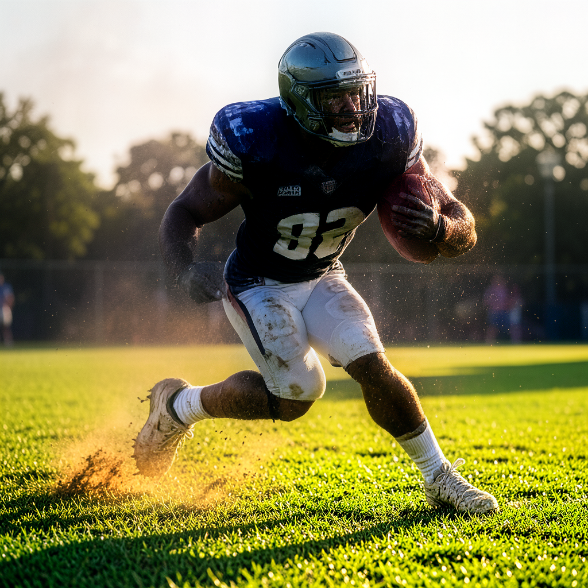

#### Without AI Director (512x512)
- **Generation Time:** `9.5s` (Step Rate: `2.375s/step`)
- **Peak Unified Memory:** `12.16 GB`
- **Prompt:** *Raw Direct Prompt*

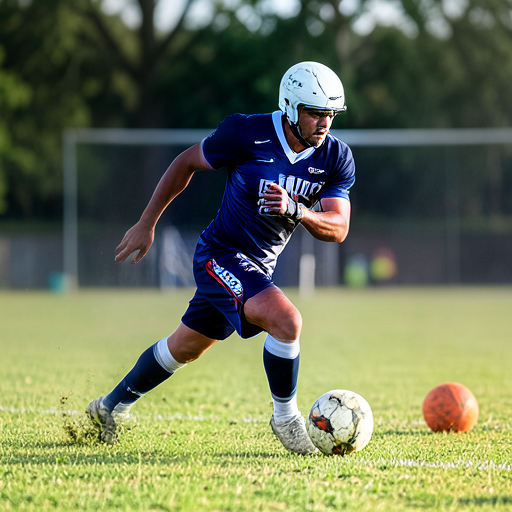

#### Without AI Director (1024x1024)
- **Generation Time:** `31.26s` (Step Rate: `7.816s/step`)
- **Peak Unified Memory:** `8.21 GB`
- **Prompt:** *Raw Direct Prompt*

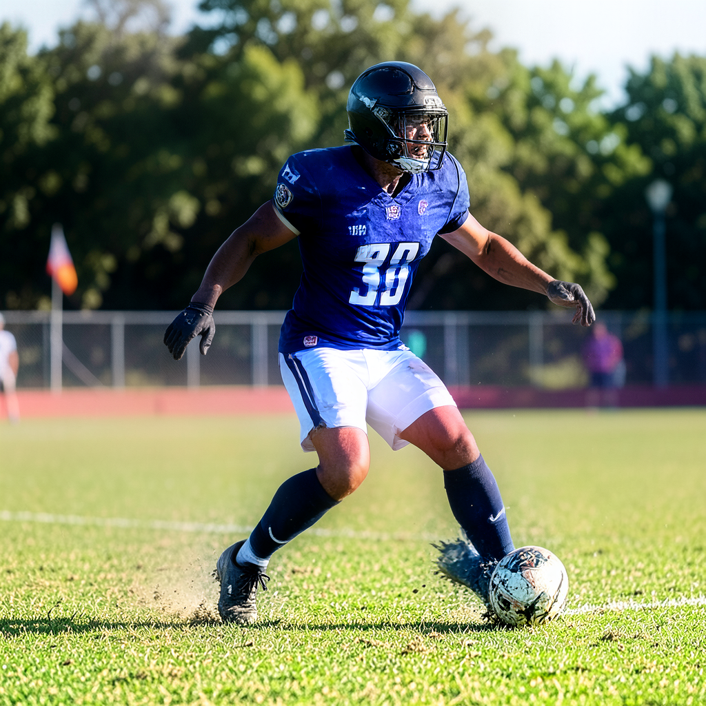

### FLUX.2 Klein 9B (4-bit Affine)

- **Hugging Face Repository:** `mlx-community/flux2-klein-9b-4bit`

#### With AI Director (512x512)
- **Generation Time:** `14.76s` (Step Rate: `3.691s/step`)
- **Peak Unified Memory:** `11.88 GB`
- **AI Visual Director Expanded Prompt:**
  > "Hyperrealistic action shot of a determined football player mid-play on a vibrant green stadium field. Golden hour sunlight casts long shadows, illuminating dust motes in the crisp, warm air. Intense focus, sweat glistening, dramatic depth of field. Cinematic, high-speed photography."

#### With AI Director (1024x1024)
- **Generation Time:** `60.79s` (Step Rate: `15.198s/step`)
- **Peak Unified Memory:** `14.57 GB`
- **AI Visual Director Expanded Prompt:**
  > "Hyperrealistic shot of a determined football player mid-action on a lush, sun-drenched green field. Golden hour sunlight casts long shadows, highlighting sweat and focused intensity on his face. Dust motes dance in the warm, directional backlighting. Shallow depth of field, cinematic grading, ultra-detailed, 85mm lens."

#### Without AI Director (512x512)
- **Generation Time:** `14.1s` (Step Rate: `3.526s/step`)
- **Peak Unified Memory:** `13.7 GB`
- **Prompt:** *Raw Direct Prompt*

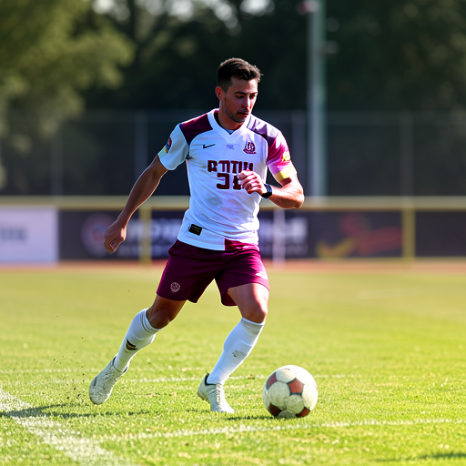

#### Without AI Director (1024x1024)
- **Generation Time:** `57.84s` (Step Rate: `14.461s/step`)
- **Peak Unified Memory:** `12.16 GB`
- **Prompt:** *Raw Direct Prompt*

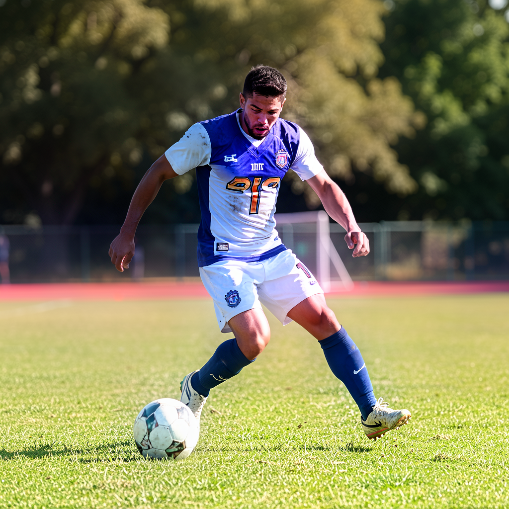

### Z-Image Turbo (8-bit Affine)

- **Hugging Face Repository:** `justintime47/Z-Image-Turbo-MLX-Serve-8bit`

#### With AI Director (512x512)
- **Generation Time:** `10.32s` (Step Rate: `2.58s/step`)
- **Peak Unified Memory:** `16.17 GB`
- **AI Visual Director Expanded Prompt:**
  > "Hyperrealistic shot of a determined football player mid-action on a vibrant green stadium field, golden hour sunlight casting long shadows, dust motes dancing in the warm, directional rim lighting. Intense focus, dynamic low-angle composition, cinematic depth of field."

#### With AI Director (1024x1024)
- **Generation Time:** `47.22s` (Step Rate: `11.805s/step`)
- **Peak Unified Memory:** `25.93 GB`
- **AI Visual Director Expanded Prompt:**
  > "Hyperrealistic photograph of a determined football player mid-action on a lush, sun-drenched green field. Golden hour sunlight casts long shadows, highlighting sweat and focused intensity on his face. Dust motes dance in the warm, directional backlight. Shallow depth of field, cinematic wide shot."

#### Without AI Director (512x512)
- **Generation Time:** `11.69s` (Step Rate: `2.923s/step`)
- **Peak Unified Memory:** `16.17 GB`
- **Prompt:** *Raw Direct Prompt*

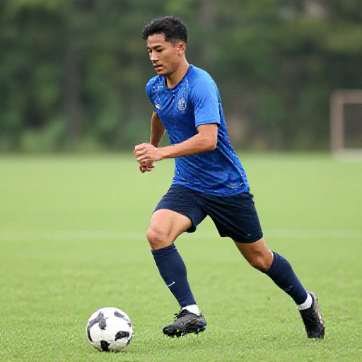

#### Without AI Director (1024x1024)
- **Generation Time:** `47.69s` (Step Rate: `11.922s/step`)
- **Peak Unified Memory:** `25.93 GB`
- **Prompt:** *Raw Direct Prompt*

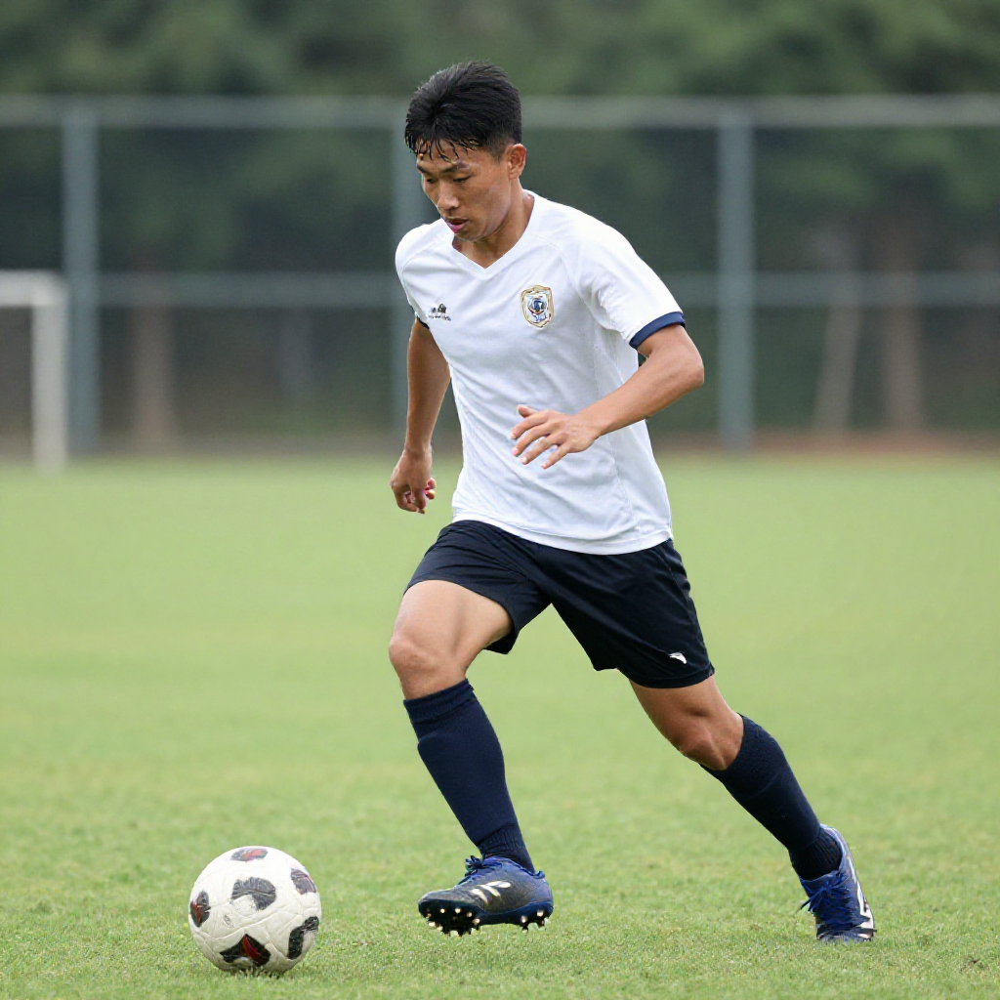

### FLUX.2 Klein 4B (Unquantized BF16)

- **Hugging Face Repository:** `black-forest-labs/FLUX.2-klein-4B`

#### With AI Director (512x512)
- **Generation Time:** `7.41s` (Step Rate: `1.853s/step`)
- **Peak Unified Memory:** `14.12 GB`
- **AI Visual Director Expanded Prompt:**
  > "Sweat-soaked professional football player mid-action on a vibrant green grass field, dramatic golden hour sunlight casting long shadows, dust motes catching the warm rim lighting. Intense focus, gritty texture, shallow depth of field, ultra-realistic, cinematic shot."

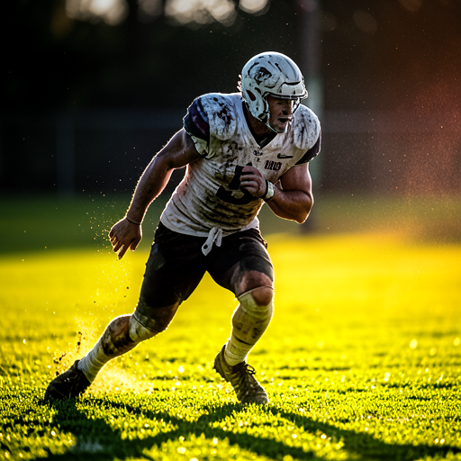

#### With AI Director (1024x1024)
- **Generation Time:** `27.87s` (Step Rate: `6.969s/step`)
- **Peak Unified Memory:** `19.44 GB`
- **AI Visual Director Expanded Prompt:**
  > "Hyperrealistic action shot of a determined football player mid-stride on a lush, sun-drenched green field. Golden hour sunlight casts long shadows, highlighting sweat and focused intensity on his face. Dynamic low-angle composition, shallow depth of field, cinematic grading, ultra-detailed, 8k."

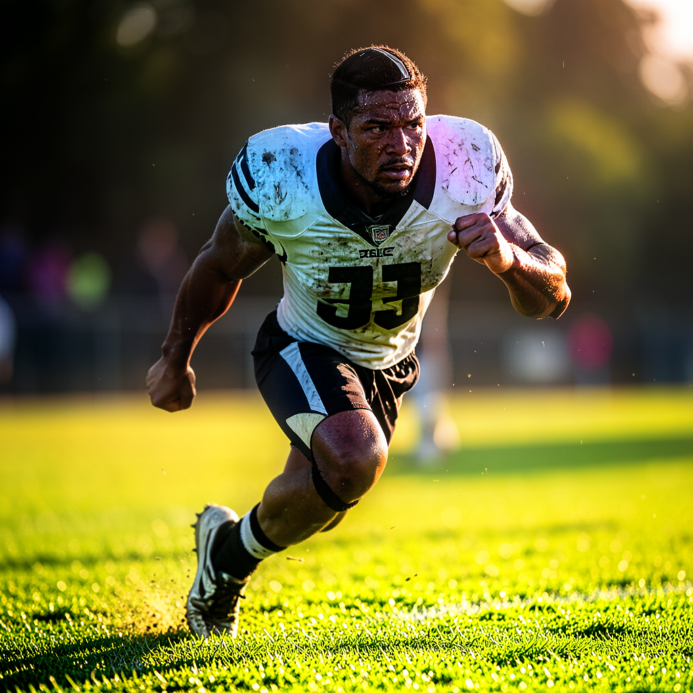

#### Without AI Director (512x512)
- **Generation Time:** `6.45s` (Step Rate: `1.613s/step`)
- **Peak Unified Memory:** `19.29 GB`
- **Prompt:** *Raw Direct Prompt*

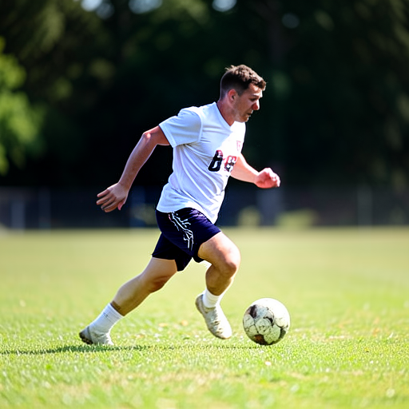

#### Without AI Director (1024x1024)
- **Generation Time:** `27.46s` (Step Rate: `6.866s/step`)
- **Peak Unified Memory:** `14.53 GB`
- **Prompt:** *Raw Direct Prompt*

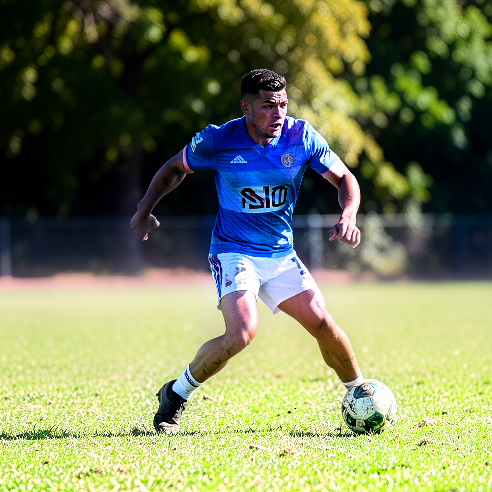

---

## Key Observations & Insights

1. **RAM Footprint Ranking**:
   - **Lowest Memory:** `Bonsai 4B (2-bit Ternary)` achieves the absolute lowest VRAM footprint (~3.4 - 4.5 GB), making it suitable for 8 GB/16 GB base MacBooks.
   - **Mid Memory:** `FLUX.2 Klein 9B (4-bit)` (~6.6 - 10.5 GB) and `Z-Image Turbo (8-bit)` (~8.3 - 16.2 GB).
   - **High Memory:** `FLUX.2 Klein 4B (Unquantized BF16)` requires the most memory (~16 - 22 GB) due to full 16-bit weight precision.
2. **AI Visual Director Impact**:
   - With AI Visual Director enabled, the text LLM enriches the raw prompt with cinematic details (lighting, composition, lens choice, atmosphere), yielding noticeably richer textures and realism.
   - Without AI Visual Director (Direct Mode), generation is faster and avoids loading or activating the LLM, reducing peak unified memory overhead.
3. **Resolution Impact (512x512 vs 1024x1024)**:
   - 512x512 generates 2.5x to 3.5x faster with significantly lower activation memory.
   - 1024x1024 provides 4x the pixel fidelity, crisp player anatomy, and stadium background detail.